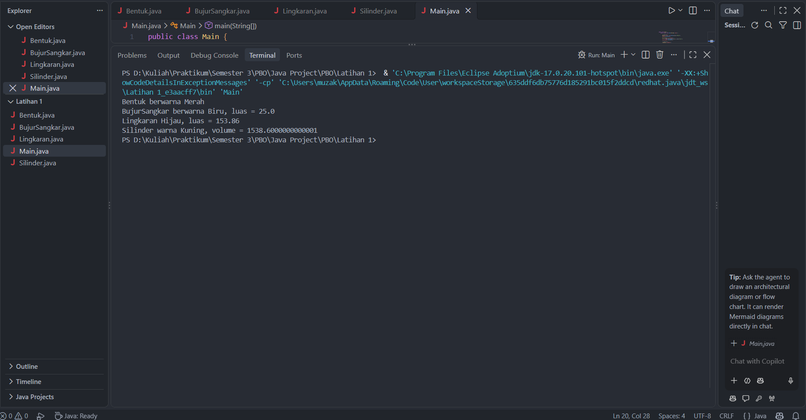

# 🎨 PBO — Abstraction, Encapsulation, Inheritance & Polymorphism

**Pemrograman Berorientasi Objek (PBO) | Java**

Repository ini berisi latihan implementasi konsep Object-Oriented Programming (OOP) menggunakan bahasa Java. Program membahas hubungan antarkelas bentuk geometri, perhitungan luas, serta perhitungan volume menggunakan konsep pewarisan dan method overriding.

---

## 📌 Deskripsi Program

Program ini terdiri dari empat class utama yang merepresentasikan bentuk geometri, yaitu `Bentuk`, `BujurSangkar`, `Lingkaran`, dan `Silinder`.

Setiap class memiliki atribut dan method sesuai fungsinya. Class turunan dapat menggunakan atribut atau method dari class induk, kemudian menyesuaikan perilakunya melalui method overriding.

Program menampilkan informasi warna dan hasil perhitungan luas atau volume dari setiap objek.

## 🎯 Tujuan Pembelajaran

- Memahami konsep dasar pemrograman berorientasi objek.
- Menerapkan encapsulation menggunakan atribut `private`.
- Memahami inheritance menggunakan kata kunci `extends`.
- Menerapkan polymorphism melalui method overriding.
- Menggunakan constructor dan `super()` untuk inisialisasi objek.
- Menghitung luas bujur sangkar, luas lingkaran, dan volume silinder.

## 📂 Struktur File

| File | Deskripsi |
|---|---|
| `Bentuk.java` | Class induk yang menyimpan warna dan method informasi bentuk. |
| `BujurSangkar.java` | Class turunan untuk menghitung luas bujur sangkar. |
| `Lingkaran.java` | Class turunan untuk menghitung luas lingkaran. |
| `Silinder.java` | Class turunan dari `Lingkaran` untuk menghitung volume silinder. |
| `Main.java` | Class utama untuk membuat objek dan menjalankan program. |

## 🧩 Penerapan Konsep OOP

### 1. Encapsulation

Encapsulation digunakan untuk melindungi data dengan menetapkan atribut sebagai `private`. Nilai atribut dapat diakses atau diubah melalui method getter dan setter.

Contoh atribut:
- `warna`
- `sisi`
- `radius`
- `tinggi`

Contoh method:
- `getWarna()`
- `setWarna()`
- `getRadius()`
- `setRadius()`

### 2. Inheritance

Inheritance memungkinkan class turunan mewarisi atribut dan method dari class induk menggunakan kata kunci `extends`.

Hubungan antarclass dalam program:

- `BujurSangkar` mewarisi `Bentuk`.
- `Lingkaran` mewarisi `Bentuk`.
- `Silinder` mewarisi `Lingkaran`.

Dengan pewarisan, class turunan dapat menggunakan kembali method yang tersedia pada class induknya.

### 3. Polymorphism

Polymorphism diterapkan melalui **method overriding**, yaitu ketika class turunan mendefinisikan ulang method yang diwarisi dari class induk.

Pada program ini, method `printInfo()` memiliki implementasi berbeda pada setiap class:

- `Bentuk` menampilkan informasi warna.
- `BujurSangkar` menampilkan warna dan luas bujur sangkar.
- `Lingkaran` menampilkan warna dan luas lingkaran.
- `Silinder` menampilkan warna dan volume silinder.

Dengan demikian, setiap objek dapat menampilkan informasi sesuai dengan jenis bentuknya.

### 4. Constructor dan `super()`

Constructor digunakan untuk memberikan nilai awal saat objek dibuat. Kata kunci `super()` digunakan untuk memanggil constructor class induk.

Contohnya, constructor `BujurSangkar` memanggil `super(warna)` untuk menginisialisasi warna pada class `Bentuk`.

### 5. Method Perhitungan

Program menggunakan beberapa method untuk melakukan perhitungan geometri:

| Method | Fungsi |
|---|---|
| `hitungLuas()` pada `BujurSangkar` | Menghitung sisi × sisi. |
| `hitungLuas()` pada `Lingkaran` | Menghitung π × radius × radius. |
| `hitungVolume()` pada `Silinder` | Menghitung luas alas × tinggi. |
| `printInfo()` | Menampilkan informasi sesuai class objek. |

## ▶️ Cara Menjalankan Program

**Persyaratan:** Java JDK sudah terpasang dan dapat digunakan melalui terminal.

1. Buka folder project di Visual Studio Code.
2. Pastikan seluruh file Java berada dalam satu folder.
3. Buka terminal pada folder tersebut.
4. Compile program menggunakan perintah:

   ```bash
   javac *.java
   ```

5. Jalankan program dengan perintah:

   ```bash
   java Main
   ```

## 📊 Contoh Output Program

```text
Bentuk berwarna Merah
BujurSangkar berwarna Biru, luas = 25.0
Lingkaran Hijau, luas = 153.86
Silinder warna Kuning, volume = 1538.6
```

*Catatan: Output mengikuti nilai warna, sisi, radius, dan tinggi yang ditentukan di dalam `Main.java`.*

## 📸 Screenshot Hasil Program

Berikut merupakan tempat untuk menampilkan screenshot hasil eksekusi program.


